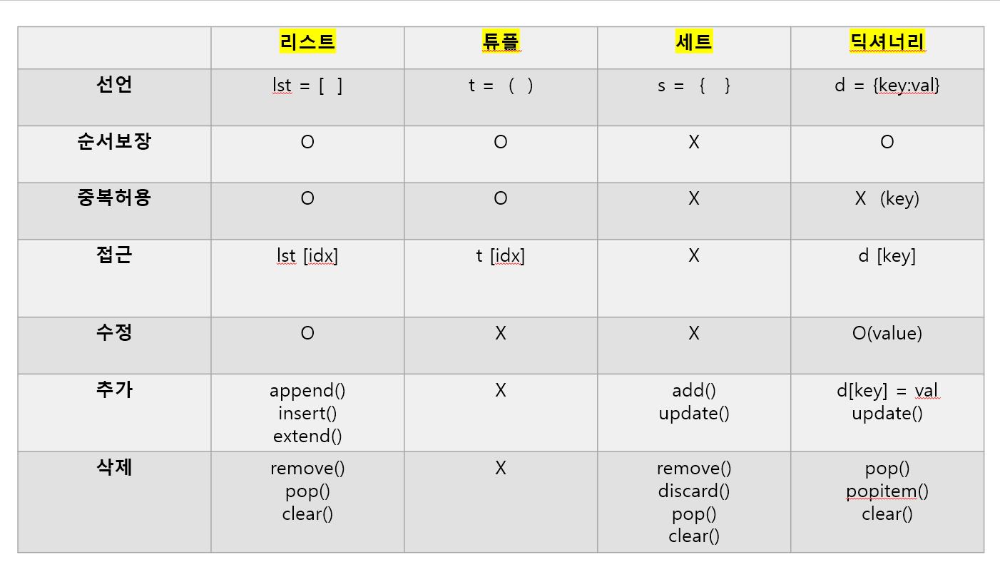

 # ✅ 자료형 정리
# 리스트 (List)
### 선언: list = [] 대괄호 `[]`사용

### 특징: 순서 O, 중복 O, 수정/삭제 O

### 인덱싱: lst[0], lst[-1] (맨 마지막은 -1)

### ex) lst[1:4] → 1 이상 4 `미만` 미만이 포인트!

### 다양한 자료형 가능: [123, 'hello']

## 💡 주요 메서드

+ `append(x)`	맨 끝에 추가
+ `insert(i, x)`	i번째 위치에 x 삽입
+ `extend(iterable)`	여러 값 추가 (리스트 병합)
+ `remove(x)`	x 값을 삭제
+ `pop()`	맨 마지막 값을 꺼내고 삭제
+ `clear()`	전체 삭제


# 코드 예시- 리스트
```python

fruits = ["사과", "바나나"]
fruits.append("포도")      # ['사과', '바나나', '포도']
fruits.insert(1, "오렌지")  # ['사과', '오렌지', '바나나', '포도']
fruits.remove("바나나")     # ['사과', '오렌지', '포도']
print(fruits[0])           # '사과'
print(fruits[-1])          # '포도'
print(fruits[1:3])         # ['오렌지', '포도']

```
***

# 튜플 (Tuple)
### 선언: t = (), t = (1, 2) 소괄호 `()` 사용

### 특징: 순서 O, 중복 O, 수정/삭제 X

읽기 전용 자료형


## 💡 패킹 & 언패킹
```python
my_tuple = ("오예스", "과자")  # 패킹
(one, two) = my_tuple          # 언패킹

numbers = (1, 2, 3, 4, 5)  
(a, b, *others) = numbers  # others로는 나머지 값들이 나온다 
                            # ex) 3,4,5
```

# 코드 예시

```
t = (1, 2, 3)
print(t[0])         # 1
# t[0] = 5          # ❌ 오류 (수정 불가)

# 언패킹 예시
a, b, *rest = (10, 20, 30, 40)
print(a)            # 10
print(rest)         # [30, 40]

```
***

# 3. 세트 (Set)
### 선언: s = {1, 2, 3}  중괄호 `{}`

### 특징: 순서 X, 중복 X, 인덱싱 X

### 사용, 요소 간 콤마, 사용

## 💡 주요 메서드


+ `add(x)`	하나 추가
+ `update(iterable)`	여러 값 추가
+ `remove(x)`	특정 값 삭제
+ `pop()`	임의의 값 삭제
+ `clear()`	전체 삭제

# 코드 예시 
```python
s = {1, 2, 3}
s.add(4)            # {1, 2, 3, 4}
s.update([5, 6])    # {1, 2, 3, 4, 5, 6}
s.remove(2)         # {1, 3, 4, 5, 6}
print(3 in s)       # True  3 in s는 3이라는 값이 집합 s에 있니? 

```
***

# 딕셔너리 (Dictionary)
### 선언: d = {'사과': 3, '바나나': 5}

### 특징: 순서 O, 키 중복 X, 수정/삭제/추가 O

### 키(key)와 값(value)을 쌍으로 관리

활용: 재고 정리 등 (수행평가에서 중요!)

```python
d = {"사과": 3, "바나나": 5}
d["사과"] = 10        # {'사과': 10, '바나나': 5}
d["포도"] = 7         # {'사과': 10, '바나나': 5, '포도': 7}
del d["바나나"]       # {'사과': 10, '포도': 7}
print(d["사과"])      # 10

```
# 반복문

# for문
```python
for x in range(10): # 10미만까지 반복
    print("팔벌려 뛰기해")
💡 range()
```
+ range(stop) → 0부터 stop 미만까지

+ range(start, stop) → start 이상 stop 미만

+ range(start, stop, step) → step 간격으로 증가

## ✅ 조건문 & 중첩 조건문
```python
if 조건:
    실행문
elif 조건:
    실행문
else:
    실행문
```
```python
if 조건1:
    if 조건2:
        실행문
```

# 함수
```python
def show_price():
    print("가격은 1000원입니다")
```

###  함수를 사용할떄 `def` 사용
### 함수 호출하지 않으면 실행 안됨!

## ✅ UPPER, 수행평가에 나옴

```python
s = "Hello"
s.lower()   # 'hello'
s.upper()   # 'HELLO'
```


# ✅ 정수 나눗셈 연산자 `//`
python
복사
편집

```python
a = 7
b = 2
print(a // b)   # 3  (소수점 버림)
```

